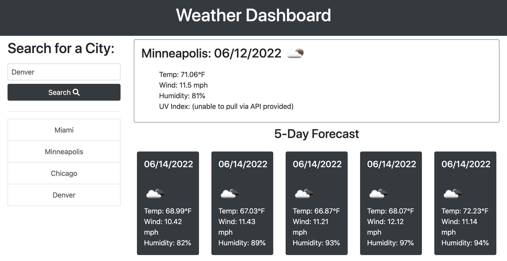

# Weather Dashboard

## About the Application
This is a weath dashboard that allows users to search a city to see what the current weather is. This application will provide the current temperature, wind speed, and humidity. 

Users can also see what the 5-day forecast is for the location they searched. This application will track historical searches. Users can click on the a past city they searched in the left module.

## Metrics Tracked
- Temperature
- Wind Speed
- Humidity
  
## How it works
1. Under 'Search for a City' type in a desired city
2. View the current weather conditions on the top of the right module
3. View the forecast to that location on the bottom of the right module
4. To view search history, look underneath the search button. You will find a list of previously searched cities. Click on each one to see the current and forecasted weather conditions.
   
## Screenshot

## Link
Link to application here: https://triciaax.github.io/weather-dashboard/ 